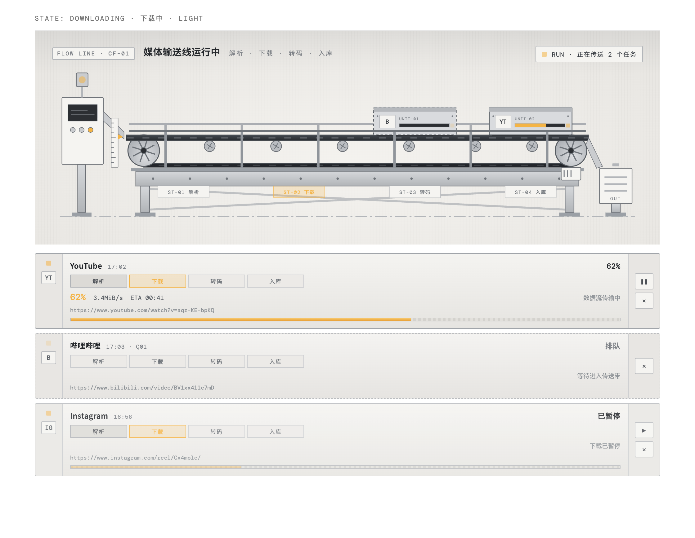

<p align="center">
  
</p>

<h1 align="center">云帧下载器</h1>

<p align="center">
  铃铛出品 · 用工业输送线呈现下载、转码与归档进度的 macOS 桌面视频下载工具。
</p>

<p align="center">
  <a href="https://github.com/Hyp-Plus/cloudframe-downloader/releases/latest">下载最新版</a>
  ·
  <a href="#安装">安装</a>
  ·
  <a href="#功能">功能</a>
  ·
  <a href="#合规文件">合规文件</a>
  ·
  <a href="#开发">开发</a>
</p>



## 简介

云帧下载器是一款本地桌面应用，用于保存你拥有下载权或已获得授权的公开媒体内容。它不把下载任务隐藏在普通列表里，而是将每一个任务呈现为沿输送线移动的任务舱：依次经过**解析、下载、转码、入库**四个工位。

项目的界面、下载任务与本地文件均在设备本机处理。项目的设计目标不是规避 DRM、付费墙、私密内容或其他访问控制；使用者不得将其用于此类用途。

## 下载

前往 [Releases](https://github.com/Hyp-Plus/cloudframe-downloader/releases/latest) 下载最新版 macOS 包：

- **macOS**：`云帧下载器-v<版本>-macos.zip`

当前正式版：[v1.0.0](https://github.com/Hyp-Plus/cloudframe-downloader/releases/tag/v1.0.0)。

## 安装

1. 下载并解压 Release 中的 ZIP 文件。
2. 将“云帧下载器.app”移动到“应用程序”文件夹。
3. 首次使用前，在终端安装下载引擎：

   ```bash
   brew install yt-dlp ffmpeg
   ```

4. 打开应用，选择平台、粘贴公开链接并设定保存位置。

> 应用目前未经过 Apple 公证。若 macOS 在首次打开时阻止它，请在“应用程序”中右键应用并选择“打开”。

## 功能

- 支持哔哩哔哩、抖音、YouTube、Instagram、小红书、X / Twitter 的公开链接识别。
- 支持画质选择、本地保存目录、下载速度、预计剩余时间与任务历史。
- 工业输送线任务视图：任务舱随真实进度经过解析、下载、转码和入库工位。
- 任务运行时，皮带、滚筒与传感器随任务移动联动；支持排队、暂停、失败、完成等状态。
- 支持浅色铝灰与深色石墨双主题，以及系统“减少动态效果”偏好。
- 任务可暂停、继续、取消；失败任务可原地重试，不会重复创建记录。
- 对代理或证书校验失败提供明确提示；不会通过关闭 TLS 校验来绕过安全问题。

## 使用说明

- 登录状态仅用于用户本人具有合法访问权的内容；**登录、Cookie 或可观看不等于拥有复制、下载、保存或再传播的授权**。
- 如果出现“证书校验失败”，请检查 Clash 或当前代理节点，然后使用任务右侧的“重试”操作。
- 文件将保存至应用中所选的本地目录；完成后可直接打开所在文件夹。

## 开发

源码位于 [`cloudframe-downloader/`](cloudframe-downloader)。

```bash
cd cloudframe-downloader
npm install
npm run dev
```

验证与生产构建：

```bash
npm run typecheck
npm run build
```

生成 macOS 应用包：

```bash
npm run package:mac
```

主要技术栈：Electron、React、TypeScript、Vite、yt-dlp、FFmpeg。

## 项目结构

```text
cloudframe-downloader/
├── electron/       # Electron 主进程与安全受限的 IPC
├── src/            # React 界面、传送线动效与任务视图
├── assets/         # 应用图标
├── preview/        # 传送线状态预览图
└── scripts/        # 打包与截图工具
```

## 合规文件

- [使用条款](docs/使用条款.md)
- [隐私政策](docs/隐私政策.md)
- [第三方平台与商标声明](docs/第三方平台与商标声明.md)
- [权利人通知与处理规则](docs/权利人通知与处理规则.md)
- [宣传合规用语](docs/宣传合规用语.md)

用于官网、商店页和社交媒体的推荐表述：

> 云帧下载器是本地媒体归档工具，仅适用于本人作品、已取得权利人授权，或平台明确允许下载和保存的公开内容。

请勿宣传为“任意平台视频下载”“无视限制下载”“会员/付费内容下载”或与任何平台存在官方合作、授权、背书关系。

## 隐私与合规

- 链接、任务状态、登录 cookie 与下载文件仅在本机处理或保存。
- 不处理私密、付费、DRM 或需要绕过访问控制的内容。
- 仅保存你拥有下载权或已获得授权的内容；使用者须遵守平台规则、版权要求与当地法律。

## 许可证

本项目以 [GNU General Public License v3.0 或更高版本](LICENSE)（GPL-3.0-or-later）开源。

任何人均可使用、研究、修改与分发本项目；若分发修改后的版本或基于本项目的衍生作品，须同时提供对应源码，并继续以 GPL-3.0-or-later 授权。

## 贡献

欢迎提交 Issue 与 Pull Request。提交前请运行：

```bash
npm run typecheck && npm run build
```

请保持项目的本地优先、安全边界：不要加入上传用户内容、绕过平台访问控制或弱化证书校验的实现。

---

<p align="center">铃铛出品 · v1.0.0</p>
